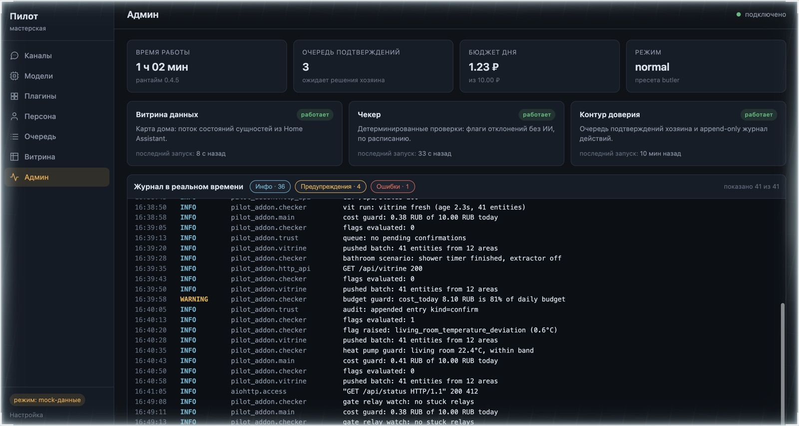
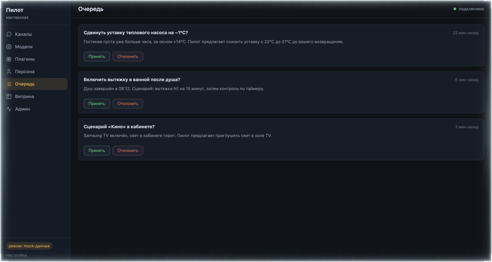
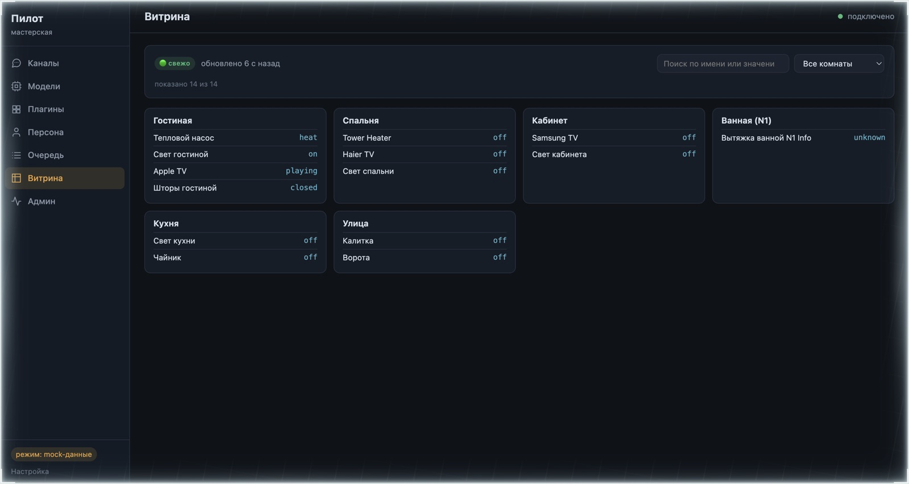
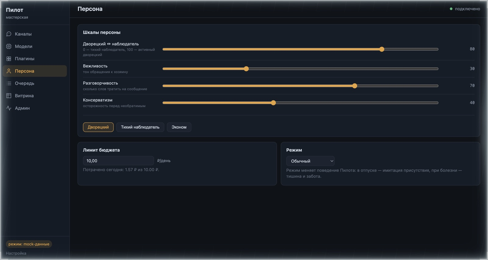

# Pilot — proactive AI agent for Home Assistant

Pilot is not an "assistant on demand". It is a **proactive home manager**: it
watches the household, derives human-level states ("awake", "away", "guests"),
keeps the owner's long-term goals, and proposes — and, as trust grows, applies —
adjustments to the home's policy. The home learns from the owner, not the other
way around.

## Установка

Pilot ставится двумя частями из одного репозитория: **интеграция**
`custom_components/pilot` (сущности и панель в HA) и **аддон** (рантайм
агента). Для пользователей это custom repository — проект пока не в
каталоге HACS.

### Требования

- Home Assistant **с Supervisor** (HA OS или Supervised) — нужен для аддона
  и автоматического обнаружения.
- Права **администратора** в HA.
- HACS — **не обязателен**: интеграцию можно поставить вручную (вариант Б).
- Аддон собирается под архитектуры `amd64` и `aarch64`.
- Интернет нужен только на этапе установки — вся работа дальше локальная.

### Шаг 1. Интеграция

**Вариант А. Через HACS (рекомендуется)**

1. HACS → **Интеграции** → меню **⋮** → **Пользовательские репозитории**.
2. URL: `https://github.com/Glukmann/HA_Pilot`, категория: **Интеграция** →
   **Добавить**.
3. Найти **Pilot Eyes** в списке → **Скачать** → перезапустить Home Assistant
   (HACS предложит сам).

**Вариант Б. Вручную**

1. В репозитории открыть папку
   [`custom_components/pilot`](https://github.com/Glukmann/HA_Pilot/tree/main/custom_components/pilot).
2. Скопировать её целиком в `/config/custom_components/pilot` (через File
   editor, Samba или SSH-дополнение).
3. Перезапустить Home Assistant.

### Шаг 2. Аддон (рантайм агента)

1. **Настройки** → **Дополнения** → **Магазин дополнений**.
2. Меню **⋮** (правый верхний угол) → **Репозитории** → добавить
   `https://github.com/Glukmann/HA_Pilot` → **Закрыть**.
3. В магазине появится карточка **Pilot** → **Установить**.
4. После установки нажать **Запустить** и проверить автозапуск:
   Настройки → Автозапуск → «Включено».

Доступ к API Home Assistant Supervisor выдаёт аддону сам, настраивать
ничего не нужно. Единственная настройка на старте — **дневной бюджет**
(₽/день, по умолчанию 10): Дополнения → Pilot → Конфигурация.

### Шаг 3. Подключение

Когда аддон запущен, он **объявляет себя** Home Assistant автоматически:

1. **Настройки** → **Устройства и службы** → в разделе «Обнаружено»
   появится **Pilot** (аддон) → **Подтвердить** → **Готово**. В списке
   интеграций появится **Pilot Eyes**.
2. Устройство «Pilot Eyes» появится в списке устройств — со статусом агента,
   очередью подтверждений, шкалами персоны и ссылкой на панель.

Если обнаружение не сработало (например, аддон запущен вне Supervisor):
**Добавить интеграцию** → **Pilot Eyes** → ввести вручную:

- **Хост** — имя аддона в сети Supervisor, например `94eaa3d6-pilot`;
- **Порт** — `8899`.

### Обновление

- **Аддон:** Магазин дополнений → карточка Pilot → кнопка **Обновить** при
  выходе новой версии. Что нового — на вкладке **Changelog** в интерфейсе.
- **Интеграция (HACS):** HACS → Интеграции → Pilot Eyes → **Обновить** →
  перезапуск HA.
- **Интеграция (вручную):** повторить вариант Б шага 1 поверх существующей
  папки → перезапуск HA.

### Если что-то пошло не так

1. **Журнал аддона:** Дополнения → Pilot → вкладка **Журнал**.
2. **Журнал HA:** Настройки → Система → **Журнал ошибок** — там же
   появляются замечания интеграции (repairs): рантайм недоступен и т.п.
3. Подробный лог интеграции — в `configuration.yaml`:

   ```yaml
   logger:
     logs:
       custom_components.pilot: debug
   ```

### Удаление

1. Настройки → Устройства и службы → Pilot Eyes → **Удалить**.
2. Дополнения → Pilot → **Остановить** → **Удалить** (опционально убрать
   репозиторий из списка репозиториев магазина).

## Why

- Trigger-based automations catch events, not intentions ("TV at 23:00" is a
  movie night, background noise, or insomnia).
- A hundred-device home can never be hand-tuned to completion; policy goes stale
  with seasons, habits, and device degradation.
- The value of a smart home is under-used because owners don't know what it
  "can do".
- Notification streams from the home turn into noise.

## Core principles

1. **The LLM is never in the real-time loop.** Frequent work is deterministic
   code (zero tokens); the AI runs rarely, over prepared data.
2. **Home Assistant is the single source of truth.** Real-time execution belongs
   to HA automations; the agent changes policy, it does not flip switches.
3. **Soft degradation.** If the agent dies, the home keeps working as a plain
   HA installation.
4. **Trust is earned, then grown.** A narrow auto-apply whitelist, a "yes/no"
   approval queue, an append-only audit log, a hard daily budget, and one-click
   rollback. Destructive/irreversible actions always require confirmation.

## What it does

- **Supervisor of goals**: deterministic checkers notice deviations (dead
  sensors, climate without effect, energy spikes, stuck lights or gates); the
  agent runs once a day over the flagged facts and adjusts setpoints within an
  explicit whitelist.
- **Pattern log**: repeated manual actions become candidates for automations —
  rules grow out of *accepted proposals*, never out of guessed patterns.
- **Butler**: contextual suggestions ("Good morning — coffee in two minutes,
  as usual?") with a persona the owner tunes (butler ↔ quiet observer,
  polite ↔ decides alone, dry ↔ chatty, conservative ↔ experimenter).
- **Derived states**: the agent reasons in human terms ("awake", "sleeps",
  "away-but-back-soon", "guests") instead of raw sensors.
- **Local memory**: raw logs, daily digests, vector search over digests,
  structured facts about the owner, self-maintained skills — all on-device.

## Скриншоты мастерской (mock-данные)

Единый интерфейс «Пилот» — пункт бокового меню HA, открывается за ingress
(авторизация — сессия HA). Снято в mock-режиме фронтенда (`VITE_PILOT_API=mock`).

| Админ: live-логи и слои рантайма | Очередь доверия: подтверждения да/нет |
|---|---|
|  |  |

| Витрина: карта дома по комнатам | Персона: шкалы, пресеты, бюджет |
|---|---|
|  |  |

## Architecture

Pilot ships as two artifacts of one repository, following the ESPHome /
Music Assistant pattern:

- **`custom_components/pilot`** — a native Home Assistant custom integration:
  one "Pilot Eyes" device with entities (status, daily cost, suggestion queue,
  persona sliders, presets, reset buttons), a conversation agent in the Assist
  pipeline with deterministic handling of simple intents, services for
  automations, repairs/diagnostics/system health. The single user-facing UI is
  the add-on's "Пилот" sidebar panel (the workshop SPA behind ingress).
- **A Home Assistant add-on** — the OpenClaw runtime: deterministic layers
  (detectors, derived states, goal metrics, pattern log, trust loop, state
  mirror), daily LLM runs, local memory, and a full-featured admin UI
  ("workshop") served via ingress.

MVP scope: local add-on mode only. A "remote instance" connection mode is
architecturally reserved for power users who run the runtime on their own
machine.

## Status

MVP (integration + add-on) is implemented and runs in the owner's home:
install via the add-on store, auto-discovery of the integration, device
entities, the «Пилот» workshop panel, state-mirror vitrine pushed by the
integration. See
[GOALS.md](GOALS.md) for product goals and [LICENSES.md](LICENSES.md) for
licensing (PolyForm Noncommercial 1.0.0 — personal use free, commercial by
agreement, see [COMMERCIAL.md](COMMERCIAL.md)).

## Author

Pilot is developed and maintained by
[Andrey Lipanov](https://www.linkedin.com/in/andrey-lipanov-5a3481122/).
Ideas, questions, and collaboration offers — via
[Issues](https://github.com/Glukmann/HA_Pilot/issues) or LinkedIn.

---

*Powered by [OpenClaw](https://github.com/openclaw/openclaw) (MIT).*
